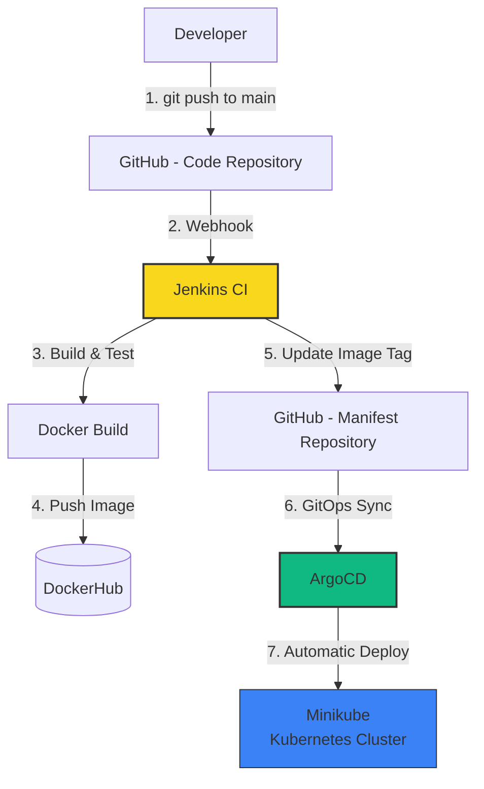

## Deploying a Simple Python Application using GitHub, Jenkins & ArgoCD (GitOps)

#### **Architecture Diagram**



**Flow Summary:**
We are using **two separate GitHub repositories**:
- **Code Repository** → Contains Python application code
- **Manifest Repository** → Contains Kubernetes YAML files (Deployment, Service, etc.)

When a developer pushes code to the `main` branch:
1. GitHub Webhook triggers Jenkins.
2. Jenkins builds the Docker image, pushes it to DockerHub, and updates the image tag in the Manifest repository.
3. ArgoCD automatically detects the change and syncs the application to Kubernetes (Minikube).

---

### **Prerequisites**

Make sure the following are installed and running:

- **Kubernetes Cluster** (Minikube)
- **Jenkins** (with required plugins)
- **ArgoCD**

---

### **1. Kubernetes (Minikube)**

```bash
# Install Docker
sudo apt update && sudo apt install docker.io -y
sudo systemctl enable --now docker

# Install kubectl
curl -LO "https://dl.k8s.io/release/$(curl -L -s https://dl.k8s.io/release/stable.txt)/bin/linux/amd64/kubectl"
chmod +x kubectl
sudo mv kubectl /usr/local/bin/

# Install Minikube
curl -Lo minikube https://github.com/kubernetes/minikube/releases/latest/download/minikube-linux-amd64
chmod +x minikube
sudo mv minikube /usr/local/bin/

# Install conntrack
sudo apt install conntrack -y

# Start Minikube
minikube start --vm-driver=none --cpus=2 --memory=4g
minikube status
```

---

### **2. Jenkins Installation**

```bash
# Install Java
sudo apt update
sudo apt install openjdk-21-jre-headless -y

# Install Jenkins
sudo wget -O /etc/apt/keyrings/jenkins-keyring.asc \
  https://pkg.jenkins.io/debian-stable/jenkins.io-2023.key
echo "deb [signed-by=/etc/apt/keyrings/jenkins-keyring.asc]" \
  https://pkg.jenkins.io/debian-stable binary/ | sudo tee \
  /etc/apt/sources.list.d/jenkins.list > /dev/null

sudo apt update
sudo apt install jenkins -y
sudo systemctl enable --now jenkins
```

Access Jenkins: `http://YOUR_SERVER_IP:8080`

Get initial password:
```bash
sudo cat /var/lib/jenkins/secrets/initialAdminPassword
```

---

### **3. ArgoCD Installation**

```bash
kubectl create namespace argocd
kubectl apply -n argocd -f https://raw.githubusercontent.com/argoproj/argo-cd/stable/manifests/install.yaml

# Change service to NodePort
kubectl patch svc argocd-server -n argocd -p '{"spec": {"type": "NodePort"}}'

# Get ArgoCD URL
kubectl get svc argocd-server -n argocd

# Get Admin Password
kubectl -n argocd get secret argocd-initial-admin-secret -o jsonpath="{.data.password}" | base64 -d; echo
```

Login at `http://YOUR_SERVER_IP:NODEPORT` (default username: `admin`)

---

### **4. GitHub Repositories**

1. **Code Repository** (Your Python App)
2. **Manifest Repository** (Kubernetes YAMLs)

**Recommended**: Fork both repositories and use your own copies.

---

### **5. Jenkins Setup**

#### **Required Plugins**
- Docker Pipeline
- Docker
- GitHub Integration
- Pipeline: GitHub Webhook
- Parameterized Trigger

#### **Store Credentials**
Go to **Manage Jenkins → Credentials** and add:
- DockerHub credentials (username + password)
- GitHub credentials (Personal Access Token)

---

#### **Job 1: Build and Push (buildimage)**

- **Type**: Pipeline
- **Pipeline script from SCM**
- Repository URL → Your **Code Repository**
- Branch: `main`
- Enable **GitHub hook trigger for GITScm polling**

**Jenkinsfile** (in your code repo):


---

#### **Job 2: Update Manifest (updatemanifest)**

- **This project is parameterized**
  - String Parameter: `DOCKERTAG` (Default: `latest`)
- **Pipeline script from SCM**
- Repository URL → Your **Manifest Repository**
- Branch: `main`

**Jenkinsfile** (in Manifest repo):


---

### **6. GitHub Webhook Setup**

1. Go to your **Code Repository** → `Settings → Webhooks → Add webhook`
2. **Payload URL**:  
   `http://YOUR_JENKINS_IP:8080/github-webhook/`
3. **Content type**: `application/json`
4. Select **Just the push event**
5. Add webhook

---

### **7. Deploy & Verify**

```bash
kubectl get pods -n <your-namespace>
kubectl get svc
```

Access your application using the Service/NodePort or Ingress.

---

**Benefits:**
- **Kubernetes**: Auto-scaling, auto-healing, self-healing
- **Jenkins**: Continuous Integration & automation
- **ArgoCD**: GitOps – No more manual `kubectl apply`

Would you like me to also provide:
- Sample Python app code + Dockerfile?
- Complete Kubernetes manifests (Deployment + Service)?
- ArgoCD Application YAML?

Just say the word and I’ll add them!
